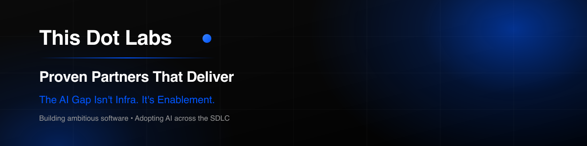

<!-- Banner rendered from profile/assets/banner.svg (1200x300). Re-render with: npx sharp-cli -i profile/assets/banner.svg -o profile/assets/banner.png resize 1200 300 -->

# Building Software for an AI-Native World

### The next evolution of software delivery is here.

We help companies solve hard software problems, modernize critical systems, and adopt AI with intention.

---

# 👋 Who we are

[This Dot Labs](https://www.thisdot.co/) is the engineering partner companies bring in when important software needs to move — fast, but also correctly. Our senior engineers solve hard problems, modernize critical systems, improve how teams work, and leave those teams more capable than when we arrived.

Founded by open source leaders in the web ecosystem — including members of the RxJS Core Team, Angular Core Team, and more — This Dot Labs is recognized as a leading company to work for and work with. We're a fully remote team representing over two dozen nationalities, and a proud **Women- and Minority-Owned Small Business**.

---

# 🤖 AI-Native Engineering

**AI is not another tool to bolt onto the engineering stack.** It changes how work is planned, software is designed, teams collaborate, and systems are governed. The durable advantage is not choosing today's best model; it is building an organization that knows how to use AI well.

Explore our AI services at **[ai.thisdot.co](https://ai.thisdot.co/)**:

- **Readiness & strategy** — connect AI opportunities to measurable business outcomes.
- **AI-enabled delivery** — create agent-ready workflows with strong context, verification, and human review.
- **Enterprise agent governance** — make AI capabilities, access, actions, costs, and risks visible and manageable.

---

# 👩‍💻 What we do

We work between strategy and implementation across **AI enablement**, **software delivery**, **architecture modernization**, **product development**, and **engineering transformation**. Through embedded engineering, assessments, workshops, and training, we help teams deliver better software and build stronger ways of working.

**Our foundation:** deep software engineering expertise, from React, Angular, Vue, Next.js, Node.js, TypeScript, GraphQL, and RxJS to AI-native development and agentic systems.

---

## 🎓 Workshops & Training

- [Training catalog](https://www.thisdot.co/trainings) — interactive, remote or in-person workshops across the modern web stack
- [JavaScript Marathon](https://www.thisdot.co/javascript-marathon) — free monthly online training
- [Apprenticeship program](https://apprentice.thisdot.co/) — pairing junior developers with senior mentors

---

## 🗓 Events & Community

- [Modern Web Meetup](https://www.meetup.com/modernweb/)
- [State of the Web](https://www.thisdotmedia.com/state-of-the-web)
- [Vue Meetup](https://www.vuemeetup.com/)

---

## 🎙 Media & Podcasts

- [This Dot Media](https://www.thisdotmedia.com/)
- [The Modern Web Podcast](https://www.thisdotmedia.com/modern-web-podcast)
- [This Dot Media on YouTube](https://www.youtube.com/thisdotmedia)

---

## 🛠 Tools, Products & Open Source

- [PerfBuddy](https://perfbuddy.com/) — free web performance & accessibility testing
- [starter.dev](https://starter.dev/) — production-ready starter kits (`npx @this-dot/create-starter`)
- [framework.dev](https://framework.dev/) — curated libraries and resources for modern frameworks
- [Open Source Packages](https://github.com/thisdot/open-source) — our published libraries and utilities

Exploring AI? A few of our open source AI projects: [`docusign-navigator-mcp`](https://github.com/thisdot/docusign-navigator-mcp), [`openai-apps-sdk-examples`](https://github.com/thisdot/openai-apps-sdk-examples), and [`claude-code-context-status-line`](https://github.com/thisdot/claude-code-context-status-line).

---

## 🤗 Our Guiding Principles

We believe in growing our relationships with our team, our clients, and the community at large by fostering a culture of inclusivity, respect, and diversity — striving to lead by example with everything we do. Please read our [code of conduct](https://www.contributor-covenant.org/version/2/1/code_of_conduct/).

### Getting Better Together

Our team values learning, teaching, and mentorship. We invest in each other and the people around us. As a minority- and women-owned business, we value the differences and unique perspectives each of us brings to work every day, and we celebrate and respect diversity by sharing our individual cultures and customs.

### Consistently Delivering Excellence

As technology partners, our integrated teams find ways to create better systems and processes, and help set standards that breed code quality, technical excellence, and a culture of mentorship. When working with external teams, we share our values through actions in hopes of creating a better working environment for others.

### Giving Back to the Community

We treat our clients and team members with the highest level of respect, and we expect that same respect among the team. We invest in historically underserved communities through our apprentice program, mentorship opportunities, and by inviting diverse voices to share their stories and work on our platforms.

---

## ✉️ Get in touch

- 🌐 [Contact us](https://www.thisdot.co/contact)
- 💼 [Careers](https://www.thisdot.co/jobs) — `jobs@thisdot.co`
- 👋 General inquiries — `hi@thisdot.co`
